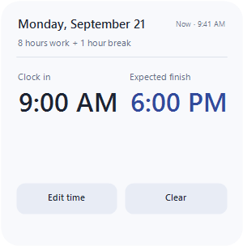
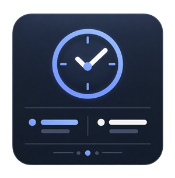

# Workday Widget

A minimal Windows 11 Widgets Board card for tracking your workday: clock in with one tap, see your expected finish time at a glance, and get reminded when it arrives.

| Light | Dark |
|---|---|
|  |  |

## Features

- **One-tap clock-in** — press "Clock in now" and the current time is recorded for the day.
- **Expected finish, always visible** — computed from clock-in time plus a configurable workday length.
- **Configurable workday length** — a small accent-colored chip cycles through presets (8, 8.5, 9, 9.5, 10 hours); default is 9.
- **Auto clock-in on unlock** (opt-in) — clocks you in automatically the first time you unlock your PC each day, so the widget never needs to be opened on a normal day.
- **Edit or clear** — fix a wrong clock-in time, or clear today's record entirely (with a confirm step).
- **12/24-hour display** — a one-tap chip next to "Now", independent of the clock-in flow.
- **Finish-time reminder** — one toast notification when your expected finish time arrives; the widget never auto clocks-out or auto-clears.
- **Timezone-safe** — clock-in and finish times always display in your machine's *current* local timezone, even if it changed after you clocked in (travel, a VM); a small note appears only when that adjustment actually happened.
- **Daily reset** — crossing into a new day clears the previous day's clock-in automatically.
- **Small / medium / large layouts**, light and dark themes.
- **Localized**: English, Traditional Chinese, Simplified Chinese (follows Windows' display language automatically).

## Design principles

No dedicated settings screen. Adaptive Cards' action model doesn't have room for one on this host anyway, and a widget you check daily shouldn't behave like a settings form. Every preference (time format, auto clock-in, workday length) lives as a small in-body, one-tap chip instead — visible when relevant, silent otherwise. The footer never carries more than two buttons at once.

## Building and installing

This isn't Store-published (see below), so it has to be built, signed, and sideloaded manually.

**Prerequisites**
- Visual Studio 2022 with the ".NET desktop development" and "Windows application development" workloads (provides MSBuild and the Windows App SDK/MSIX packaging tools). The .NET 8 SDK alone is enough for `dotnet build`, but packaging an installable `.msix` requires MSBuild.
- A code-signing certificate whose subject matches the identity in `src/WorkdayWidget/Package.appxmanifest` (`CN=Workday Widget`). If you don't have one yet, create a self-signed dev cert once:
  ```powershell
  New-SelfSignedCertificate -Type Custom -Subject "CN=Workday Widget" `
    -KeyUsage DigitalSignature -FriendlyName "Workday Widget Dev Cert" `
    -CertStoreLocation "Cert:\CurrentUser\My" `
    -TextExtension @("2.5.29.37={text}1.3.6.1.5.5.7.3.3", "2.5.29.19={text}")
  ```

**Build and package**
```powershell
& "C:\Program Files\Microsoft Visual Studio\2022\Community\MSBuild\Current\Bin\MSBuild.exe" `
  src\WorkdayWidget\CsConsoleWidgetProvider.csproj `
  /p:Configuration=Release /p:Platform=x64 `
  /p:AppxBundle=Never /p:UapAppxPackageBuildMode=SideloadOnly `
  /p:GenerateAppxPackageOnBuild=true /restore
```
This produces `src\WorkdayWidget\AppPackages\CsConsoleWidgetProvider_<version>_x64_Test\CsConsoleWidgetProvider_<version>_x64.msix`, unsigned.

**Sign it** (thumbprint from the cert created above, or `Get-ChildItem Cert:\CurrentUser\My` to find an existing one):
```powershell
& "C:\Program Files (x86)\Windows Kits\10\bin\10.0.22621.0\x64\signtool.exe" `
  sign /fd SHA256 /sha1 <thumbprint> /s My <path-to-.msix>
```

**Install** (stop the running provider first if you're upgrading an existing install — Windows refuses to replace files still in use):
```powershell
Get-Process -Name WorkdayWidget -ErrorAction SilentlyContinue | Stop-Process -Force
Add-AppxPackage -Path <path-to-.msix> -ForceApplicationShutdown
```

Then press `Win + W`, open "Add widgets," and pin Workday Widget.

## Repository contents

- `src/WorkdayWidget/` — the shipped Windows Widget Provider (Windows App SDK, Adaptive Cards 1.5, COM widget provider model).
- `outputs/WorkdayWidget/` — an earlier local prototype (a standalone script/native-window version) kept for reference; not part of the current implementation.

## License

This project is available under the [MIT License](LICENSE).
