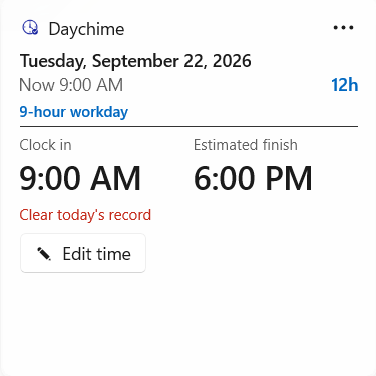

# Daychime

A focused Windows 11 widget for tracking your workday: clock in with one tap, see your estimated finish at a glance, and get a reminder when it arrives.



## Features

- **One-tap clock-in** — press "Clock in now" and the current time is recorded for the day.
- **Estimated finish, always visible** — computed from clock-in time plus a configurable workday length.
- **Actual clock-out** — clock out when you leave to record the real finish time and elapsed time. Undo an accidental clock-out before starting another shift.
- **Configurable workday length** — a small accent-colored chip cycles through presets (8, 8.5, 9, 9.5, 10 hours); default is 9.
- **Auto clock-in after your chosen time** (opt-in) — records the first eligible unlock in each work cycle. If Windows stopped the widget provider, opening the widget uses the opening time as a fallback. Set 06:00 for a typical day job or 18:00 for a night shift.
- **Edit or clear** — fix a wrong clock-in time, or clear the current shift entirely (with a confirm step).
- **12/24-hour display** — a one-tap chip next to "Now", independent of the clock-in flow.
- **Finish-time reminder** — a Windows notification at your estimated finish time, with a **Clock out now** button that records the time you click. Old notifications cannot clock out a newer shift; undo an accidental clock-out in the widget. Windows notification settings apply, and reminders can be missed when the computer is off.
- **Timezone-safe** — clock-in and finish times always display in your machine's *current* local timezone, even if it changed after you clocked in (travel, a VM); a small note appears only when that adjustment actually happened.
- **Overnight and next-day handling** — a shift can cross midnight. A missed clock-out does not block the next eligible auto clock-in: the previous shift is marked as missing an actual clock-out, and the new shift uses the unlock time. A stale shift clears 24 hours after its estimated finish if no new shift starts.
- **Recent shift** — the last shift stays in a compact summary for 24 hours after its actual or estimated finish, clearly distinguishing recorded and missing clock-outs.
- **Small / medium / large layouts**, light and dark themes.
- **Localized**: English, Traditional Chinese, Simplified Chinese (follows Windows' display language automatically).

## Design principles

No dedicated settings screen. Adaptive Cards' action model doesn't have room for one on this host anyway, and a widget you check daily shouldn't behave like a settings form. Every preference (time format, auto clock-in, workday length) lives as a small in-body, one-tap chip instead — visible when relevant, silent otherwise. The footer never carries more than two buttons at once.

## Install

Get [Daychime from Microsoft Store](https://apps.microsoft.com/detail/9NJKQT7SNSJL) on Windows 11. No manual package download or certificate setup is needed.

After installation, open `Win + W`, open the widget picker, and add Daychime. Microsoft Store handles app updates; use **Check for updates** in the Store to check manually.

The features above describe the current source version. The published Store version may lag behind while an update is awaiting certification.

See the [Privacy Policy](PRIVACY.md).

## Development builds

This is a Windows Widget provider, so it cannot be run inside a normal Docker container: the Widget host, MSIX deployment, and certificate store are Windows integrations. Instead, the repository provides a Docker-like single build entry point that makes the Windows build reproducible and discoverable.

**Prerequisites**

- Visual Studio 2022 with the ".NET desktop development" and "Windows application development" workloads (provides MSBuild and the Windows App SDK/MSIX packaging tools).

**Everyday development build**
```powershell
./scripts/Build.ps1
```

**Create a Store upload package**
```powershell
./scripts/Build.ps1 -Configuration Release -Architecture x64 -StoreUpload -OutputDirectory artifacts
```

The script emits `artifacts\Daychime.msixupload` for Partner Center, not for end-user installation. Microsoft Store signs and distributes the package; no code-signing certificate is needed for Store submission. Local MSIX installation requires developer signing. Use `-Clean` to remove this project's generated build and package files before building.

## Releases

Development uses `main` with version tags, not a full Gitflow branch model. Pull requests and pushes to `main` run tests and build checks. Pushing a `v*` tag runs tests and produces the `Daychime-store-upload` artifact in the **Build Microsoft Store package** workflow. The tag must match the package manifest version: for example, `v1.0.37` corresponds to `1.0.37.0`. Mismatched tags fail; the workflow does not change the version.

A tag identifies release source, not Store approval. To submit an update, sign in to GitHub, open the matching successful run under [Actions](https://github.com/klhq/daychime/actions/workflows/store-package.yml), and download **Daychime-store-upload** from **Artifacts**. Extract the ZIP and upload `Daychime.msixupload` to Partner Center → **Packages**, then submit for certification.

The workflow handles testing and packaging only; Store submission is manual. No Partner Center credentials, Entra tenant, or signing secrets are needed in GitHub. You can also use **Run workflow** to build an artifact without creating a tag.

Release instructions for maintainers are in [docs/RELEASING.md](docs/RELEASING.md).
Store listing copy and screenshot requirements are in [docs/STORE_LISTING.md](docs/STORE_LISTING.md).

## Repository contents

- `src/DaychimeWidget/` — the shipped Windows Widget Provider (Windows App SDK, Adaptive Cards 1.5, COM widget provider model).

## License

This project is available under the [MIT License](LICENSE).
